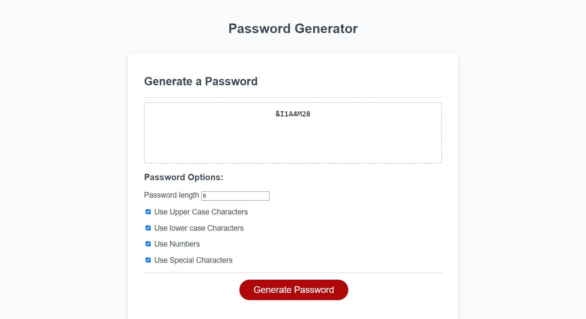
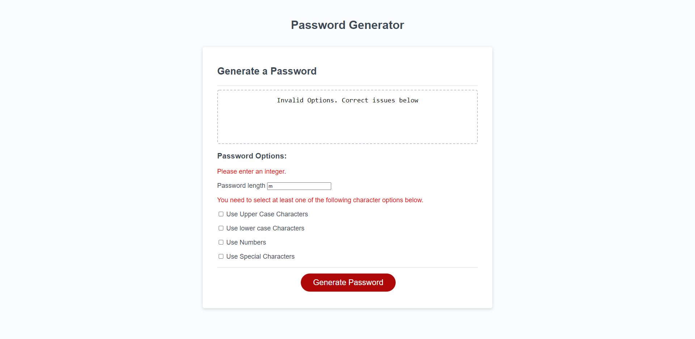

# Password-Generator

# Christopher Kennard's 3rd home work assignment

## Task: Create a Password Generator that can include lowercase, uppercase, numeric, and/or special characters and allow user to decide which characters they would or would not like included as well as password length.

## Languages / Systems used to complete this assignment

1. JavaScript
2. HTML
3. CSS
4. Git

# screen shot

# links

- [deployed website](https://chris79kennard.github.io/Password-Generator/)
- [repository](https://github.com/chris79kennard/Password-Generator)
